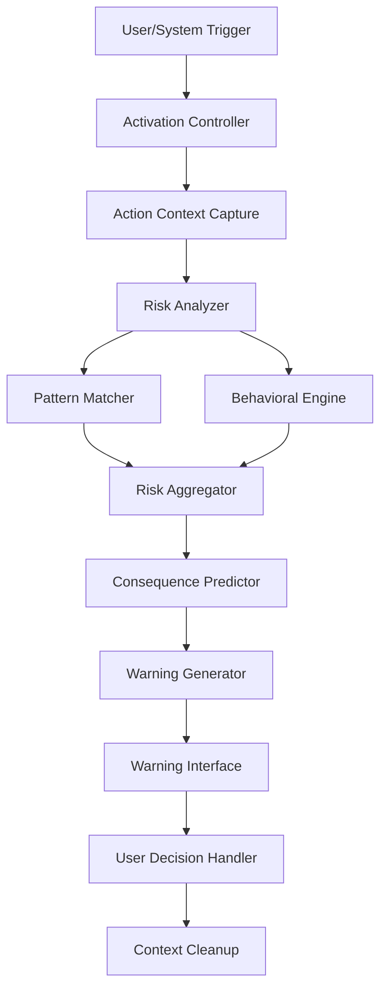

# Design Document: Sentinel AI Runtime Safety

## Overview

Sentinel AI is architected as a lightweight, privacy-first runtime safety system that operates entirely on the user's local device. The system follows a pipeline architecture: Action Capture → Risk Analysis → Warning Generation → User Decision. All processing occurs in-memory with no persistent storage of user actions or sensitive data.

The design emphasizes three core principles:
1. **Privacy by Architecture**: No data leaves the device; all analysis is local
2. **Real-time Performance**: Sub-300ms analysis for responsive user experience
3. **Extensibility**: Pluggable risk patterns and behavioral models for evolving threats

## Technologies

### Core Language and Runtime

- **Go 1.21+**: Primary implementation language chosen for:
  - Native concurrency support (goroutines) for parallel pattern matching
  - Fast compilation and execution for performance requirements
  - Strong standard library for cryptography, networking, and file operations
  - Cross-platform support without runtime dependencies
  - Memory safety and garbage collection for secure processing

### Testing Frameworks

- **gopter**: Property-based testing library for Go
  - Generates random test cases to verify correctness properties
  - Minimum 100 iterations per property test
  - Validates universal properties across all inputs

- **testify**: Assertion and mocking library
  - Provides readable assertions for unit tests
  - Mock support for component isolation
  - Suite support for test organization

### CLI Framework

- **cobra**: Command-line interface framework
  - Structured command hierarchy (analyze, update, list-patterns, version)
  - Flag parsing and validation
  - Help text generation
  - Interactive mode support

### Cryptography and Security

- **crypto/sha256**: Standard library package for update verification
  - Checksum calculation for integrity verification
  - Signature validation for update packages
  - No external dependencies for security-critical operations

### Data Serialization

- **encoding/json**: Standard library JSON support
  - Pattern and model serialization
  - Configuration file parsing
  - Update package format
  - Zero external dependencies

### Concurrency Primitives

- **sync**: Standard library synchronization
  - Mutex for thread-safe session management
  - WaitGroup for parallel pattern evaluation
  - Atomic operations for performance counters

### Storage

- **Local file system**: Pattern and model storage
  - No database dependencies for simplicity
  - JSON files for human-readable patterns
  - Directory-based organization
  - No persistent user data storage

### Development Tools

- **go mod**: Dependency management
- **go test**: Built-in testing framework
- **go build**: Native compilation
- **gofmt/goimports**: Code formatting

### Design Rationale

The technology choices prioritize:
- **Minimal dependencies**: Reduce attack surface and maintenance burden
- **Standard library first**: Leverage Go's robust standard library
- **Performance**: Native compilation and efficient concurrency
- **Privacy**: No cloud services or external data transmission
- **Portability**: Cross-platform support without runtime requirements
- **Security**: Built-in cryptography without third-party libraries

## Architecture

### High-Level Architecture



### Component Layers

1. **Activation Layer**: Handles invocation triggers and lifecycle management
2. **Capture Layer**: Extracts action context from various sources
3. **Analysis Layer**: Performs risk pattern matching and behavioral analysis
4. **Presentation Layer**: Generates and displays warnings with consequence predictions
5. **Decision Layer**: Processes user responses and manages action flow

### Privacy Architecture

All components operate on ephemeral data structures that are explicitly cleared after each analysis cycle. No component has access to persistent storage for user action data. Risk patterns and behavioral models are stored locally but contain no user-specific information.

## Components and Interfaces

### 1. Activation Controller

**Responsibility**: Manages Sentinel AI lifecycle and activation triggers

**Interface**:
```
interface ActivationController {
  activateOnDemand(): AnalysisSession
  registerSystemTrigger(trigger: TriggerCondition): void
  deactivate(session: AnalysisSession): void
}

type TriggerCondition = {
  eventType: string
  condition: (context: any) => boolean
}

type AnalysisSession = {
  sessionId: string
  startTime: number
  context: ActionContext
}
```

**Behavior**:
- Activates within 100ms of invocation
- Creates ephemeral analysis session
- Ensures cleanup on completion

### 2. Action Context Capture

**Responsibility**: Extracts relevant context from current action without persistent storage

**Interface**:
```
interface ActionContextCapture {
  captureContext(actionType: ActionType): ActionContext
  clearContext(context: ActionContext): void
}

type ActionType = 
  | "command"
  | "file_operation"
  | "network_request"
  | "financial_transaction"
  | "system_config"

type ActionContext = {
  actionType: ActionType
  parameters: Record<string, any>
  environment: EnvironmentSnapshot
  timestamp: number
}

type EnvironmentSnapshot = {
  workingDirectory?: string
  networkState?: NetworkState
  userPermissions?: string[]
}
```

**Behavior**:
- Captures only action-relevant context
- No storage of captured data beyond analysis session
- Supports multiple action types

### 3. Risk Analyzer

**Responsibility**: Coordinates pattern matching and behavioral analysis

**Interface**:
```
interface RiskAnalyzer {
  analyze(context: ActionContext): RiskAssessment
}

type RiskAssessment = {
  riskLevel: RiskLevel
  detectedPatterns: DetectedPattern[]
  behavioralFindings: BehavioralFinding[]
  overallScore: number
}

type RiskLevel = "safe" | "low" | "medium" | "high" | "critical"

type DetectedPattern = {
  patternId: string
  patternName: string
  confidence: number
  matchedFeatures: string[]
}

type BehavioralFinding = {
  findingType: string
  description: string
  severity: number
  actionChain?: string[]
}
```

**Behavior**:
- Completes analysis within 300ms for 95% of cases
- Aggregates results from pattern matcher and behavioral engine
- Calculates overall risk score

### 4. Pattern Matcher

**Responsibility**: Matches action context against known risk patterns

**Interface**:
```
interface PatternMatcher {
  matchPatterns(context: ActionContext): DetectedPattern[]
  loadPatterns(patterns: RiskPattern[]): void
}

type RiskPattern = {
  id: string
  name: string
  category: PatternCategory
  features: PatternFeature[]
  severity: number
}

type PatternCategory = 
  | "phishing"
  | "financial_scam"
  | "malicious_command"
  | "social_engineering"
  | "data_exfiltration"

type PatternFeature = {
  featureType: string
  matcher: (context: ActionContext) => boolean
  weight: number
}
```

**Behavior**:
- Evaluates all loaded patterns against context
- Returns matches with confidence scores
- Completes matching within 200ms

### 5. Behavioral Engine

**Responsibility**: Analyzes action sequences and decision chains for complex threats

**Interface**:
```
interface BehavioralEngine {
  analyzeSequence(context: ActionContext, recentContext?: ActionContext[]): BehavioralFinding[]
  loadModels(models: BehavioralModel[]): void
}

type BehavioralModel = {
  id: string
  name: string
  chainPatterns: ChainPattern[]
  escalationRules: EscalationRule[]
}

type ChainPattern = {
  steps: StepMatcher[]
  riskIndicator: string
}

type StepMatcher = {
  actionType: ActionType
  condition: (context: ActionContext) => boolean
}

type EscalationRule = {
  fromLevel: RiskLevel
  toLevel: RiskLevel
  condition: (findings: BehavioralFinding[]) => boolean
}
```

**Behavior**:
- Analyzes current action in context of recent actions (if provided)
- Detects harmful decision chains
- Identifies risk escalation patterns
- Does not require persistent action history

### 6. Consequence Predictor

**Responsibility**: Generates predictions of possible outcomes based on detected risks

**Interface**:
```
interface ConsequencePredictor {
  predictConsequences(assessment: RiskAssessment, context: ActionContext): Consequence[]
}

type Consequence = {
  description: string
  severity: "low" | "medium" | "high"
  timeframe: "immediate" | "short_term" | "long_term"
  likelihood: number
  category: ConsequenceCategory
}

type ConsequenceCategory = 
  | "data_loss"
  | "financial_loss"
  | "privacy_breach"
  | "system_compromise"
  | "reputation_damage"
```

**Behavior**:
- Generates consequences based on risk patterns and behavioral findings
- Provides both immediate and long-term impact predictions
- Indicates likelihood and severity ranges

### 7. Warning Generator

**Responsibility**: Creates user-friendly warning messages from risk assessments

**Interface**:
```
interface WarningGenerator {
  generateWarning(assessment: RiskAssessment, consequences: Consequence[]): Warning
}

type Warning = {
  title: string
  summary: string
  riskLevel: RiskLevel
  detectedThreats: ThreatDescription[]
  consequences: Consequence[]
  recommendations: string[]
  actionOptions: ActionOption[]
}

type ThreatDescription = {
  name: string
  explanation: string
  technicalDetails?: string
}

type ActionOption = {
  action: "proceed" | "cancel" | "more_info"
  label: string
  description: string
}
```

**Behavior**:
- Presents information in clear, non-technical language
- Prioritizes threats by severity
- Provides actionable recommendations

### 8. Warning Interface

**Responsibility**: Displays warnings to users and captures decisions

**Interface**:
```
interface WarningInterface {
  displayWarning(warning: Warning): Promise<UserDecision>
  displayProgress(message: string): void
}

type UserDecision = {
  action: "proceed" | "cancel" | "more_info"
  timestamp: number
}
```

**Behavior**:
- Displays warnings within 300ms of analysis completion
- Blocks action execution until user decision
- Respects user choice without forcing cancellation

### 9. Pattern Update Manager

**Responsibility**: Manages updates to risk patterns and behavioral models

**Interface**:
```
interface PatternUpdateManager {
  checkForUpdates(): UpdateInfo[]
  downloadUpdate(updateId: string): Promise<UpdatePackage>
  verifyUpdate(package: UpdatePackage): boolean
  applyUpdate(package: UpdatePackage): void
}

type UpdateInfo = {
  updateId: string
  version: string
  description: string
  size: number
  releaseDate: string
}

type UpdatePackage = {
  patterns?: RiskPattern[]
  models?: BehavioralModel[]
  signature: string
  metadata: UpdateMetadata
}

type UpdateMetadata = {
  version: string
  checksum: string
  timestamp: number
}
```

**Behavior**:
- Downloads only anonymized pattern definitions
- Verifies integrity and authenticity before applying
- Applies updates without compromising privacy

## Data Models

### Core Data Structures

**ActionContext**: Ephemeral structure containing current action information
- Exists only during analysis session
- Cleared immediately after analysis
- Contains no personally identifiable information in structure itself

**RiskAssessment**: Analysis result containing detected risks
- Aggregates pattern matches and behavioral findings
- Includes overall risk score and level
- Used to generate warnings and consequences

**Warning**: User-facing representation of detected risks
- Contains non-technical explanations
- Includes consequence predictions
- Provides clear action options

### Storage Model

**Local Pattern Storage**:
- Risk patterns stored in local database
- Behavioral models stored in local database
- No user action data stored persistently
- Pattern updates downloaded and verified before storage

**Ephemeral Session Data**:
- ActionContext exists only in memory during session
- Automatically cleared on session completion
- No logging or persistence of sensitive action data

## Correctness Properties

*A property is a characteristic or behavior that should hold true across all valid executions of a system—essentially, a formal statement about what the system should do. Properties serve as the bridge between human-readable specifications and machine-verifiable correctness guarantees.*


### Property 1: Activation Performance

*For any* user invocation or system trigger event, Sentinel AI activation should complete within 100 milliseconds and successfully capture the action context.

**Validates: Requirements 1.1, 1.2, 1.3**

### Property 2: Complete Session Cleanup

*For any* analysis session, when the session completes (either successfully or with error), all temporary action context data should be immediately cleared from memory with no persistent storage.

**Validates: Requirements 1.4, 2.3**

### Property 3: Privacy-First Processing

*For any* risk analysis operation, the system should perform all processing using only locally stored patterns and models without any network transmission of action data, and should never persist user action history.

**Validates: Requirements 2.1, 2.2, 2.4**

### Property 4: Anonymized Updates Only

*For any* pattern update package downloaded by the system, the package should contain only anonymized pattern definitions with no user-specific data or identifiable information.

**Validates: Requirements 2.5**

### Property 5: Comprehensive Pattern Evaluation

*For any* action context and set of loaded risk patterns, the pattern matcher should evaluate the context against all patterns and include all matches in the risk assessment.

**Validates: Requirements 3.1, 3.2, 3.4**

### Property 6: Pattern Category Support

*For any* risk pattern from the categories phishing, financial scams, malicious commands, or social engineering, the system should be able to load and evaluate that pattern against action contexts.

**Validates: Requirements 3.3**

### Property 7: Pattern Matching Performance

*For any* typical action context, pattern matching should complete within 200 milliseconds.

**Validates: Requirements 3.5**

### Property 8: Behavioral Model Application

*For any* action context, the behavioral engine should evaluate it using all loaded behavioral models and include any detected harmful decision chains in the risk assessment.

**Validates: Requirements 4.1, 4.2**

### Property 9: Stateless Behavioral Analysis

*For any* action sequence analysis, the behavioral engine should be able to detect patterns using only the provided in-memory context without requiring access to persistent action history.

**Validates: Requirements 4.3**

### Property 10: Risk Escalation Highlighting

*For any* risk assessment where behavioral analysis identifies escalating risk levels, the generated warning should include information about the risk progression.

**Validates: Requirements 4.4**

### Property 11: Warning Display Before Execution

*For any* risk assessment indicating potential danger (risk level above "safe"), a warning should be displayed to the user before the action is allowed to execute.

**Validates: Requirements 5.1**

### Property 12: Complete Warning Content

*For any* generated warning, it should include the risk level, all detected patterns, predicted consequences, and available action options (proceed, cancel, more_info).

**Validates: Requirements 5.2, 7.1, 7.2**

### Property 13: Severity-Based Prioritization

*For any* warning containing multiple detected risks, the risks should be ordered by severity with highest severity risks presented first.

**Validates: Requirements 5.4**

### Property 14: End-to-End Performance

*For any* analysis session, the total time from activation to warning display should be within 300 milliseconds for 95% of typical actions.

**Validates: Requirements 5.5, 9.1**

### Property 15: Consequence Generation

*For any* risk assessment with detected risks, the consequence predictor should generate at least one predicted consequence, and consequences should include both immediate and long-term timeframe categories.

**Validates: Requirements 6.1, 6.2**

### Property 16: Model-Based Consequences

*For any* generated consequence, it should be derivable from either a matched risk pattern or a behavioral model finding, not from arbitrary sources.

**Validates: Requirements 6.3**

### Property 17: Severity Range Indication

*For any* set of predicted consequences with varying severity levels, the warning should indicate the range of possible outcomes from lowest to highest severity.

**Validates: Requirements 6.4**

### Property 18: Detailed Information on Request

*For any* warning displayed to a user, if the user selects the "more_info" option, the system should provide detailed explanations of all detected risks with technical details.

**Validates: Requirements 7.3**

### Property 19: User Decision Respect

*For any* warning where the user chooses to proceed, the system should allow the action to continue without blocking or preventing execution.

**Validates: Requirements 7.4**

### Property 20: Update Without Reinstallation

*For any* pattern or model update, applying the update should not require system reinstallation or restart, and the updated patterns should be immediately available for analysis.

**Validates: Requirements 8.1**

### Property 21: Update Integrity Verification

*For any* downloaded update package, the system should verify its cryptographic signature and checksum before applying it, and should reject packages that fail verification.

**Validates: Requirements 8.2**

### Property 22: User-Controlled Updates

*For any* available pattern update, the system should notify the user of its availability and allow the user to manually initiate the update rather than applying it automatically.

**Validates: Requirements 8.3**

### Property 23: Privacy-Preserving Updates

*For any* update operation (download, verify, apply), no user action data or behavioral information should be transmitted to update servers or stored in update packages.

**Validates: Requirements 8.4**

### Property 24: Progress Indication for Slow Analysis

*For any* analysis operation that exceeds 500 milliseconds, a progress indicator should be displayed to the user before the operation completes.

**Validates: Requirements 9.2**

### Property 25: Graceful Degradation

*For any* analysis operation under constrained system resources (low memory, high CPU load), the system should continue to function and produce results without crashing, even if performance degrades.

**Validates: Requirements 9.4**

### Property 26: Multi-Type Action Support

*For any* action of type command-line operation, file operation, network request, or financial transaction, the system should be able to extract action context and perform risk analysis.

**Validates: Requirements 10.1, 10.3**

### Property 27: Type-Appropriate Pattern Application

*For any* action type, the risk analyzer should apply patterns and behavioral models that are appropriate for that specific action type rather than using generic patterns for all types.

**Validates: Requirements 10.2**

### Property 28: Unsupported Type Handling

*For any* action type that is not supported by the system, attempting to analyze it should result in an informative error message rather than a false "safe" assessment.

**Validates: Requirements 10.4**

## Error Handling

### Error Categories

1. **Activation Errors**: System unable to activate or capture context
2. **Analysis Errors**: Pattern matching or behavioral analysis failures
3. **Performance Errors**: Analysis exceeding time limits
4. **Update Errors**: Pattern update download, verification, or application failures
5. **Resource Errors**: Insufficient memory or system resources

### Error Handling Strategies

**Activation Errors**:
- Log error details locally (no user data)
- Notify user that safety check could not be performed
- Default to cautious mode: suggest user review action manually
- Never silently fail and allow potentially dangerous action

**Analysis Errors**:
- Attempt partial analysis with available patterns/models
- Report which components failed
- Provide warning based on partial results
- Indicate uncertainty in risk assessment

**Performance Errors**:
- Display progress indicator after 500ms
- Allow user to cancel slow analysis
- If timeout occurs, report incomplete analysis
- Suggest reducing pattern set or updating system

**Update Errors**:
- Verify integrity before applying (reject on failure)
- Rollback to previous patterns if update fails
- Maintain system functionality with existing patterns
- Provide clear error messages about update failure

**Resource Errors**:
- Reduce analysis depth under constraints
- Prioritize critical pattern categories
- Warn user about degraded protection
- Continue functioning rather than failing completely

### Error Recovery

All errors should be recoverable without system restart. Temporary failures should not corrupt pattern storage or leave system in inconsistent state. Error messages should be clear and actionable, guiding users on next steps.

## Testing Strategy

### Dual Testing Approach

The testing strategy employs both unit testing and property-based testing as complementary approaches:

- **Unit tests**: Verify specific examples, edge cases, and error conditions
- **Property tests**: Verify universal properties across all inputs
- Together these provide comprehensive coverage: unit tests catch concrete bugs while property tests verify general correctness

### Property-Based Testing

**Framework Selection**:
- For TypeScript/JavaScript: Use `fast-check` library
- For Python: Use `hypothesis` library
- For other languages: Select appropriate PBT framework

**Configuration**:
- Each property test must run minimum 100 iterations
- Each test must reference its design document property
- Tag format: `Feature: sentinel-ai-runtime-safety, Property {number}: {property_text}`
- Each correctness property must be implemented by a single property-based test

**Property Test Coverage**:
- All 28 correctness properties must have corresponding property tests
- Tests should generate random action contexts, risk patterns, and behavioral models
- Tests should verify properties hold across diverse inputs
- Tests should include edge cases in generation (empty contexts, maximum patterns, etc.)

### Unit Testing

**Focus Areas**:
- Specific examples demonstrating correct behavior
- Integration points between components
- Edge cases: empty inputs, maximum sizes, boundary conditions
- Error conditions: invalid inputs, resource exhaustion, corrupted data

**Balance**:
- Avoid writing too many unit tests for cases covered by property tests
- Focus unit tests on concrete scenarios and integration validation
- Use unit tests to document expected behavior through examples

### Test Organization

```
tests/
├── unit/
│   ├── activation.test.ts
│   ├── pattern-matcher.test.ts
│   ├── behavioral-engine.test.ts
│   ├── warning-generator.test.ts
│   └── update-manager.test.ts
├── property/
│   ├── activation-properties.test.ts
│   ├── privacy-properties.test.ts
│   ├── pattern-properties.test.ts
│   ├── behavioral-properties.test.ts
│   ├── warning-properties.test.ts
│   ├── performance-properties.test.ts
│   └── update-properties.test.ts
└── integration/
    ├── end-to-end-flow.test.ts
    └── error-scenarios.test.ts
```

### Performance Testing

- Measure activation time across 1000+ invocations
- Verify 95th percentile analysis time under 300ms
- Test performance under resource constraints
- Validate pattern matching scales with pattern count

### Privacy Testing

- Monitor network activity during analysis (should be zero)
- Verify no persistent storage of action data
- Confirm memory cleanup after sessions
- Validate update packages contain no user data

### Integration Testing

- Test complete flow from activation to user decision
- Verify component interactions
- Test error propagation and recovery
- Validate system behavior under various conditions
